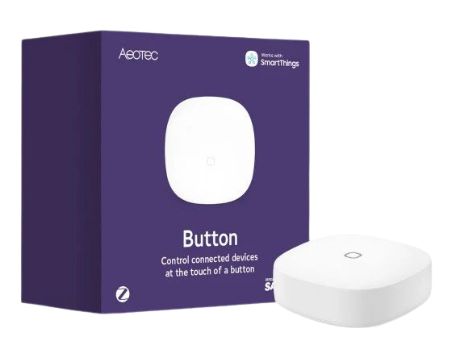

import ButtonParams from '@site/src/components/ButtonParams';

# Aeotec Button

<ButtonParams dimensions="41×41×15mm" interf="Zigbee" count="1" events="true"></ButtonParams>

## Připojení do Home Assistantu

- Pokud jste ta doposud neučinili, nainstalujte podporu pro [mqtt](/docs/home-assistant#instalace-mqtt) a doplněk [zibee2mqtt](/docs/home-assistant#instalace-zigbee2mqtt) podle návodů pod těmito odkazy.
- Pro spárování zařízení klikněte na stránce doplňku `zigbee2mqtt` na `Otevřít webové rozhraní`.
- V hlavním menu klikněte na tlačítko `Povolit připojení`
- Pomocí špendlíku podržte na zadní straně tlačítka resetovací tlačítko po dobu alespoň 5s (přední strana tlačítka začne střídavě blikat červeně a zeleně)
- Tlačítko se poté objeví v přehledové stránce `zigbee2mqtt` a bude dostupné mezi MQTT entitami

