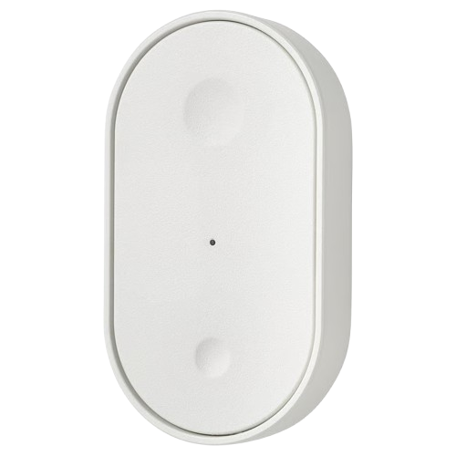

import ButtonParams from '@site/src/components/ButtonParams';

# Ikea BILRESA

<ButtonParams dimensions="19×70×40mm" interf="Matter over Thread" count="2" events="krátké stisknutí, dlouhé stisknutí, dvojité stisknutí"></ButtonParams>

## Připojení do Home Assistantu

- Pokud jste ta doposud neučinili, nainstalujte podporu pro [Matter over Thread](/docs/home-assistant#instalace-matter-over-thread)
- Před párováním je dobré tlačítko vyresetovat do továrního nastavení. To provede demontáží krytu tlačítka a podržení resetovacího tlačítka (uprostřed) po dobu dokud 5× nezabliká červeně.
- Pro spárování zařízení klikněte v mobilní aplikaci Home Assistant Companion: Nastavení | Matter | Přidat zařízení.
- Nascanujte QR kód na spodní straně tlačítka (pod magnetickým držákem)
- V průběhu vyhledávání / připojování se k zařízení párkrát zmáčkněte libovolné tlačítko (způsobí probuzení z úsporného režimu)

:::warning[Upozornění]

Párování zařízení Matter over Thread je možné pouze z mobilních telefonů (Android i iOS) s nainstalovanou aplikací Home Assistant Companion.

:::

