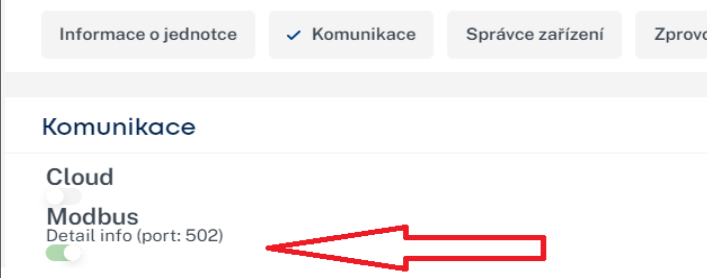

import HRUIntegrationParams from '@site/src/components/HRUIntegrationParams';

# Atrea Duplex AM

Připojení rekuperačních jednotek Atrea Duplex s řízením aMotion od společnosti [Atrea](https://atrea.eu/) k Home Assistantu pomocí aplikace LUFTaTOR.

:::tip

Podpořte tento open-source projekt zakoupením rekuperační jednotky Atrea Duplex či příslušenství k ní na eshopu [Luftuj.cz](https://www.luftuj.cz/vyrobci/atrea/)

:::

## Parametry integrace

<HRUIntegrationParams interf="ModbusTCP" power="% nebo m³/h pro jednotky constant flow" temperature="true" mode="true"></HRUIntegrationParams>

## Připojení jednotky

Rekuperační jednotky Atrea disponují protokolem Modbus TCP, stačí tedy zapojit jednotku pomocí síťového kabelu do Vašeho routeru.

- Do webového prohlížeče zadejte IP adresu vaší jednotky Atrea a přihlašte se
- Povolte Modbus TCP komunikaci

## Nastavení v aplikaci LUFTaTOR

- Zvolte typ jednotky `Atrea Duplex AM` nebo `Atrea Duplex AM.CF` pokud máte jednotku s funkcní constant flow. 
- Zadejte IP adresu Vaší rekuperační jednotky a port 502

