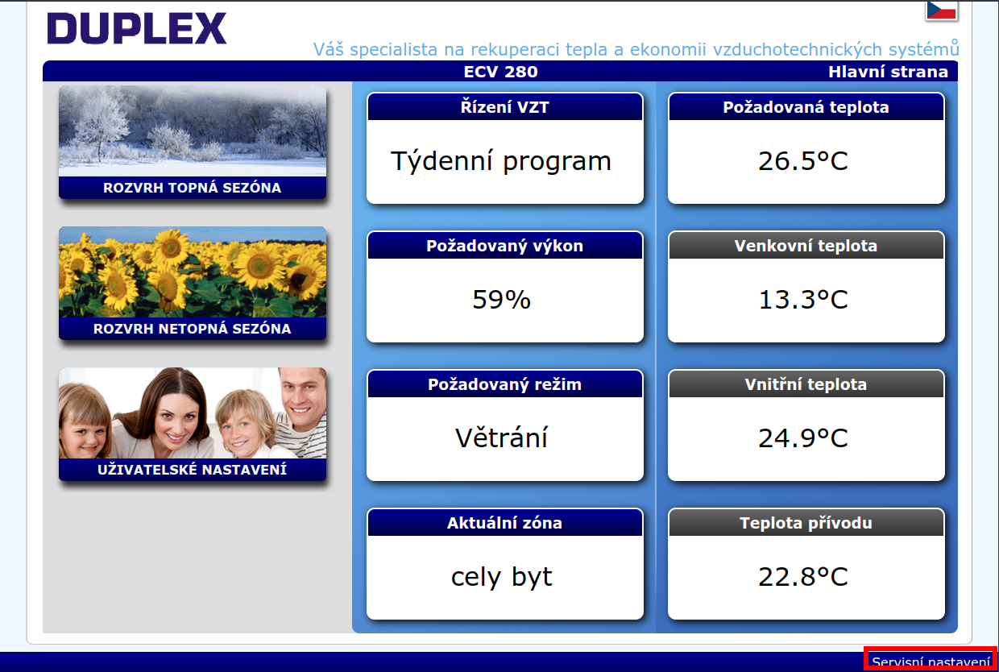
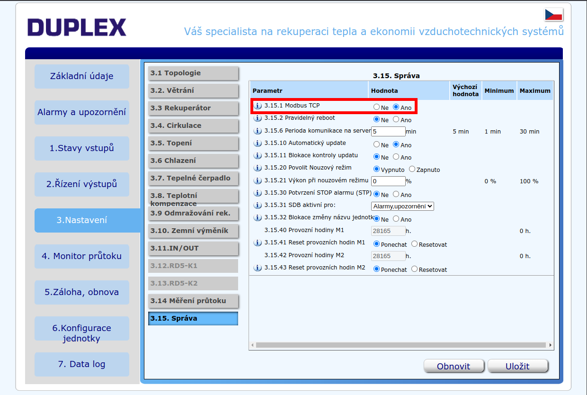
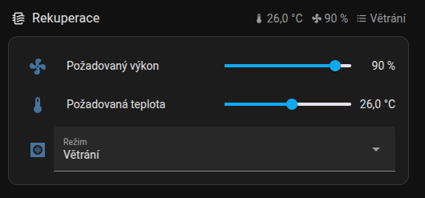

import HRUIntegrationParams from '@site/src/components/HRUIntegrationParams';

# Atrea Duplex RD5

Připojení rekuperačních jednotek Atrea Duplex s řízením RD5 od společnosti [Atrea](https://atrea.eu/) k Home Assistantu pomocí aplikace LUFTaTOR.

:::tip

Podpořte tento open-source projekt zakoupením rekuperační jednotky Atrea Duplex či příslušenství k ní na eshopu [Luftuj.cz](https://www.luftuj.cz/vyrobci/atrea/)

:::

## Parametry integrace

<HRUIntegrationParams interf="ModbusTCP" power="procenta 0-100%" temperature="true" mode="true"></HRUIntegrationParams>

## Připojení jednotky

Rekuperační jednotky Atrea disponují protokolem Modbus TCP, stačí tedy zapojit jednotku pomocí síťového kabelu do Vašeho routeru.

- Do webového prohlížeče zadejte IP adresu vaší jednotky Atrea a přihlašte se (výchozí heslo: pass)
- V pravém dolním rohu klikněte na odkaz Servisní nastavení

- Na kartě `3. Nastavení` zvolte podmenu `3.15. Správa` a přepněte parametr `3.15.1 Modbus TCP` na Ano

:::note[Upozornění]

Pokud nemáte přístup do servisního nastavení, kontaktujte autorizovaného servisního technika

:::

## Nastavení v aplikaci LUFTaTOR

- Zvolte typ jednotky `Atrea Duplex RD5`
- Zadejte IP adresu Vaší rekuperační jednotky a port 502

## Nastavení v čistém Home Assistantu

- Do souboru configuration.yaml v Home Assistantu přidejte obsah souboru [configuration.yaml](/home-assistant/atrea-rd5/configuration.yaml) a řetězec IP_ADDRESS nahraďte skutečnou IP adresou Vaší rekuperační jednotky (např. 192.168.0.10)
- Přidejte soubor [automations-atrea-rd5.yaml](/home-assistant/atrea-rd5/automations-atrea-rd5.yaml)
- Přidejte soubor [scripts-atrea-rd5.yaml](/home-assistant/atrea-rd5/scripts-atrea-rd5.yaml)
