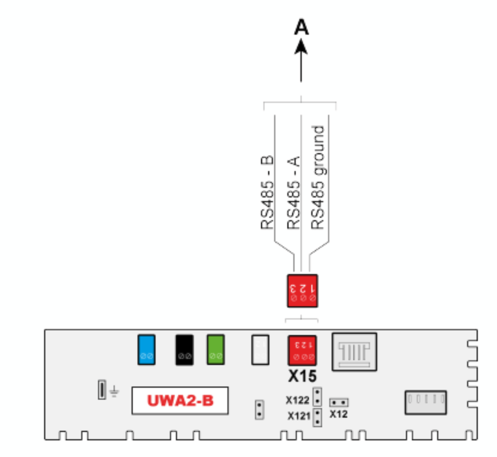

import HRUIntegrationParams from '@site/src/components/HRUIntegrationParams';

# Brink Renovent

Připojení rekuperačních jednotek Flare od společnosti [Brink](https://www.brinkclimatesystems.com/) k Home Assistantu pomocí aplikace LUFTaTOR.

## Parametry integrace

<HRUIntegrationParams interf="ModbusTCP" power="m³/h"></HRUIntegrationParams>

V přednastavených režimech, lze také konfigurovat režimu bypassu.

Jednotka dále poskytuje přívodní a odvodní teplotu a informaci o nutnosti výměny filtrů.

## Připojení jednotky

Rekuperační jednotky Brink Flare disponují rozhraním ModbusRTU, pro připojení je tedy potřeba použít [převodník ModbusRTU na ModbusTCP](/docs/modbus).

## Nastavení v aplikaci LUFTaTOR

- Zvolte typ jednotky `Brink Renovent (UWA2)`
- Zadejte IP adresu jednotky a port 502
- ID jednotky (výchozí hodnota je 20)
