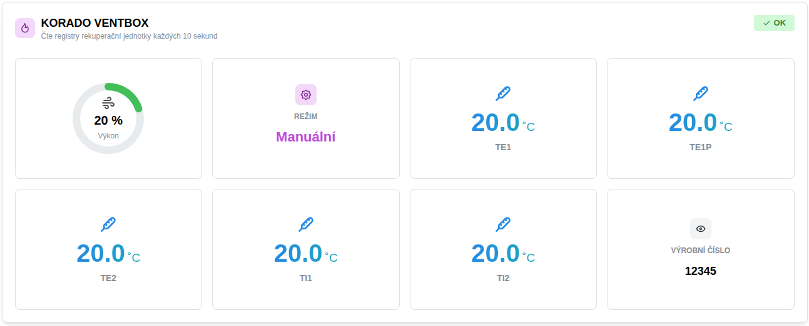
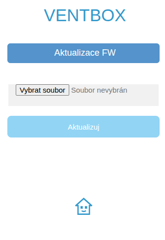
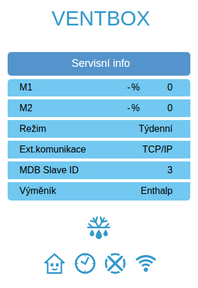
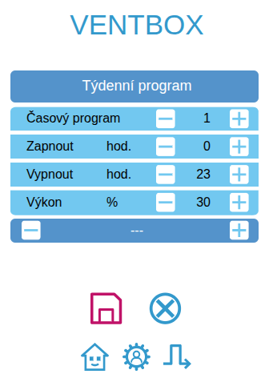

import Tabs from '@theme/Tabs';
import TabItem from '@theme/TabItem';
import HRUIntegrationParams from '@site/src/components/HRUIntegrationParams';

# KORADO VENTBOX

Připojení rekuperačních jednotek VENTBOX od společnosti [Korado](https://korado.cz/) k Home Assistantu pomocí aplikace LUFTaTOR.

:::tip

Podpořte tento open-source projekt zakoupením rekuperační jednotky KORADO VENTBOX či příslušenství k ní na eshopu [Luftuj.cz](https://www.luftuj.cz/vyrobci/korado-a-s/)

:::

## Parametry integrace

<HRUIntegrationParams interf="ModbusTCP" power="0-100%"></HRUIntegrationParams>

## Připojení jednotky

Rekuperační jednotky KORADO VENTBOX od verze FW 2.487 přímo disponují rozhraním ModbusTCP. Pokud máte starší verzi FW, stáhněte si aktuální ze stránek výrobce,
připojte se na webové rozhraní rekuperační jednotky a firmware poaktualizujte.

## Nastavení jednotky

- Jednotka musí být nastavena na:
  - **Režim**: Týdenní
  - **Ext. komunikace**: TCP/IP

- V nastavení chodu v týdenním režimu (ikona kalendář) nastavit na všech 10 možných režimech v nastavení dnů jen samé čárky, aby jednotka poslouchala nadřazený systém

## Nastavení v aplikaci LUFTaTOR

- Zvolte typ jednotky `KORADO VENTBOX`
- Zadejte IP adresu jednotky, port 502 a unit ID stejné jako v `MDB Slave ID` v nastavení jednotky (výchozí hodnota je 3)
