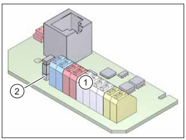
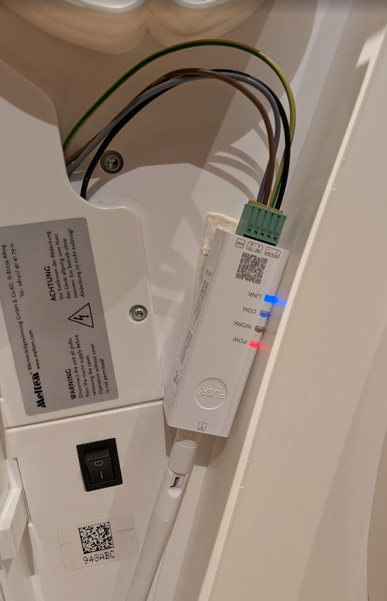

import Tabs from '@theme/Tabs';
import TabItem from '@theme/TabItem';
import HRUIntegrationParams from '@site/src/components/HRUIntegrationParams';

# Meltem

Připojení rekuperačních jednotek od společnosti [Meltem](https://www.meltem.com/) k Home Assistantu pomocí aplikace LUFTaTOR.

:::tip

Podpořte tento open-source projekt zakoupením rekuperační jednotky Meltem či příslušenství k ní na eshopu [Luftuj.cz](https://www.luftuj.cz/vyrobci/meltem/)

:::

## Parametry integrace

<HRUIntegrationParams interf="ModbusTCP" power="m³/h"></HRUIntegrationParams>

## Připojení jednotky

Rekuperační jednotky Xhouse a Xflat disponují rozhraním ModbusRTU, pro připojení je tedy potřeba použít [převodník ModbusRTU na ModbusTCP](/docs/modbus).

Zapojení Modbus RTU v jednotce Meltem je následující

- Modrá svorkovnice: datový vodič A
- Červená svorkovnice: datový vodič B

V jednotce je dost prostoru na umístění malého 12V zdroje (např. pro LED diody), který můžete využít pro napájení [bezdrátového převodníku PUSR](/docs/modbus/pusr).

Podle použitého převodníku proveďte jeho konfiguraci dle [návodu](/docs/modbus).

## Nastavení v aplikaci LUFTaTOR

- Zvolte typ jednotky `Meltem`
- Zadejte IP adresu převodníku a port 502
