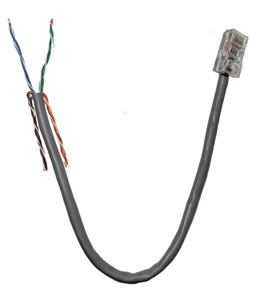
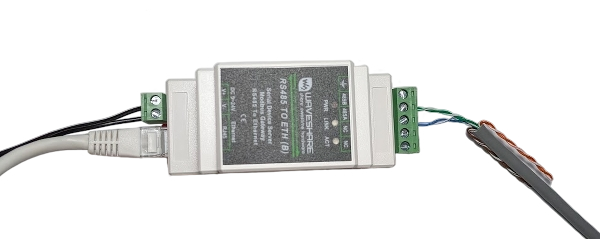

import Tabs from '@theme/Tabs';
import TabItem from '@theme/TabItem';
import HRUIntegrationParams from '@site/src/components/HRUIntegrationParams';

# Xvent

Připojení jednotek Xhouse a Xflat od společnosti [Xvent](https://xvent.cz/) k Home Assistantu pomocí aplikace LUFTaTOR.

## Parametry integrace

<HRUIntegrationParams interf="ModbusRTU" power="stupně 0 - 7" />

## Připojení jednotky

Rekuperační jednotky disponují rozhraním ModbusRTU, pro připojení je tedy třeba nejprve zakoupit převodník umožňující
převádět ModbusRTU na ModbusTCP.

Použít můžete například převodník [Waveshare RS485 to RJ45 Ethernet](https://www.waveshare.com/rs485-to-eth-b.htm), který lze zakoupit například na [RPIShop.cz](https://rpishop.cz/seriove-servery/4615-waveshare-prumyslovy-seriovy-server-rs485-na-rj45-ethernet-tcpip.htm)

Zapojení Modbus RTU na RJ45 konektoru na Xvent jednotkách je následující:

Kontakty:
1) nezapojeno
2) nezapojeno
3) RS485-A
4) RS485-A
5) RS485-B
6) RS485-B
7) nezapojeno
8) nezapojeno

Připravte si tedy takovýto kabel

- Připravte si libovolný zdroj stejnosměrného proudu 9-24V a zapojte ho do napájecí svorkovnice převodníku Waveshare.
- Datové vodiče zapojte do svorkovnice označené 485A a 485B a druhý konec opatřený konektorem RJ45 zapojte do jednotky Xvent. 
- Síťový kabel připojte do zdířky RJ45 na převodníku Waveshare.

## Konfigurace převodníku

- Nastavte ve svém PC pevnou IP adresu 192.168.1.100 a masku sítě 255.255.255.0
- Připojte síťový kabel do svého PC či notebooku
- Otevřete webový prohlížeč a připojte se na IP adresu http://192.168.1.254
- Zadejte heslo pro přihlášení do rozhraní  (výchozí heslo: 123456 - napsáno z boku převodníku)
- Nastavte síťové připojení, tak aby zařízení bylo zařazeno ve LAN (buď pomocí statické IP nebo DHCP)

:::warning[Upozornění]

V případě použití DHCP je potřeba vytvořit ve vašem routeru rezervaci na MAC adresu, aby se přidělená IP adresa neměnila.
MAC adresu převodníku naleznete na boku převodníku.

:::

Nastavte parametry:
- Network Settings
  * Device Port: 502
  * Work Mode: TCP Server
- Serial Settings
  * Baudrate: 19200
  * Databits: 8
  * Parity: Even
  * Stopbits: 1
  * Flow control: None
- Mlity-Host Settings
  * Protocol: Modbus TCP to RTU
