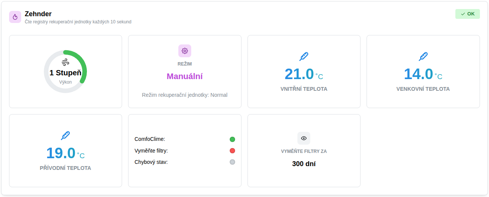
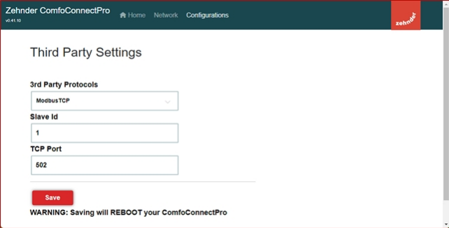

import Tabs from '@theme/Tabs';
import TabItem from '@theme/TabItem';
import HRUIntegrationParams from '@site/src/components/HRUIntegrationParams';

# Zehnder

Připojení rekuperačních jednotek [Zehnder](https://www.zehnder.cz/cs) k Home Assistantu pomocí aplikace LUFTaTOR.

:::tip

Podpořte tento open-source projekt zakoupením rekuperační jednotky Zehnder či příslušenství k ní na eshopu [Luftuj.cz](http://luftuj.cz/vyrobci/zehnder/)

:::

## Parametry integrace

<HRUIntegrationParams interf="ModbusTCP" power="0-3" mode="standard, cool, warm"></HRUIntegrationParams>

## Připojení jednotky

Pro připojení jednotky Zehnder k chytré domácnosti potřebujete zakoupit modul [Zehnder ComfoConnect](https://www.zehnder.cz/cs/komfortni-vetrani/produkty/vetraci-jednotky/ovladani/zehnder-comfoconnect-pro). 
Popis připojení naleznete v manuálu výrobce na výše uvedeném odkazu.

## Nastavení v aplikaci LUFTaTOR

- Zvolte typ jednotky `Zehnder`
- Zadejte IP adresu jednotky, port 502 a unit ID stejné jako v `Slave ID` v nastavení jednotky (výchozí hodnota je 1)
