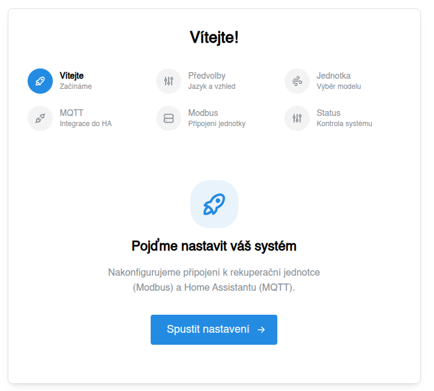
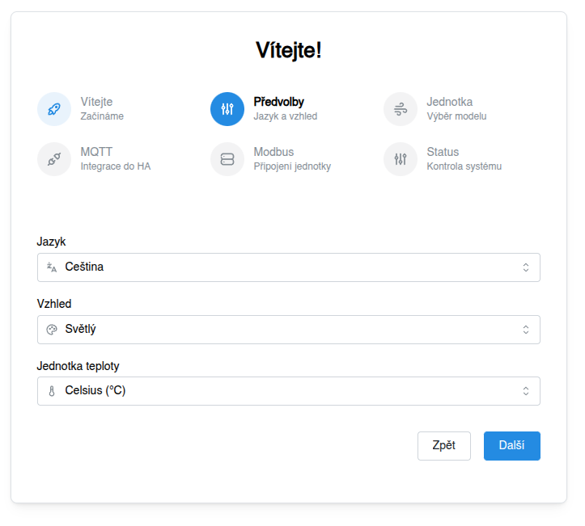
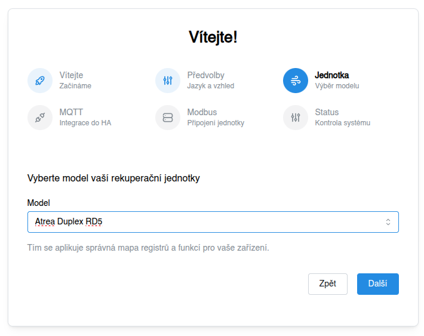
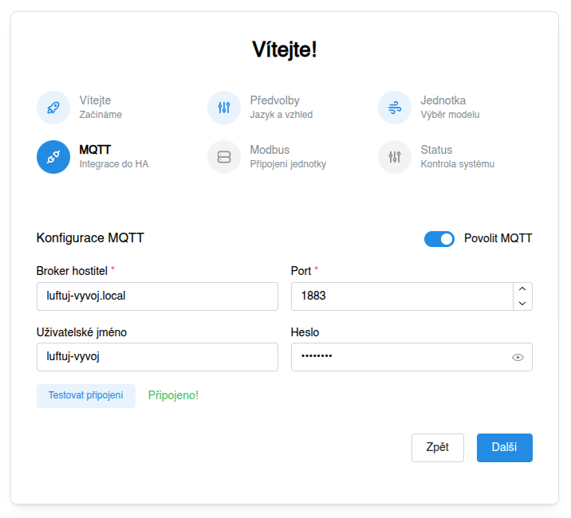
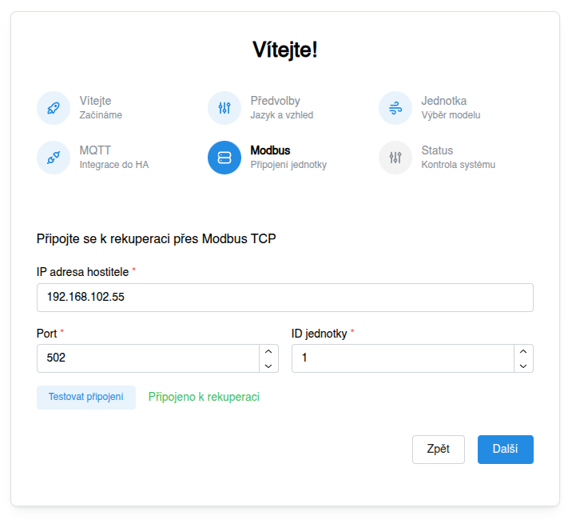
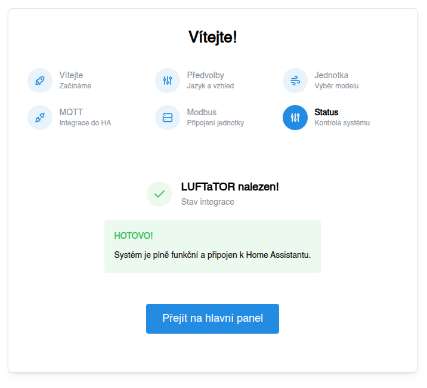
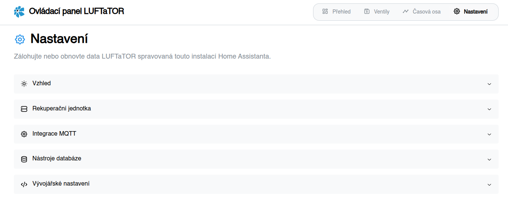

# Prvotní nastavení

Pro prvotní nastavení aplikace LUFTaTOR je k dispozici přehledný průvodce.

## Vítejte

- Na úvodní obravce klikněte na tlačítko Spustit nastavení

## Předvolby
 

- Zvolte jazyk rozhraní ve kterém chcete aplikaci LUFTaTOR používat
- Vyberte si, zda chcete LUFTaTOR provozovat ve světlém či tmavém rozhraní
- Zvolte, zda jednotku pro teplotu budete využívat stupně Celsia nebo Fahrenheita
- Klikněte na tlačítko "Další"

## Jednotka

- Zvolte Vámi používanou Rekuperační jednotku. Pokud Vaše jednotka není na [seznamu podporovaných rekuperačních jednotek](/docs/rekuperacni-jednotky), pomožte nám ji [přidat](https://github.com/luftuj-cz/home-assistant/tree/main/addon/rootfs/usr/src/app/src/features/hru/definitions) nebo [založte požadavek na přidání jednotky](https://github.com/luftuj-cz/home-assistant/issues/new), do kterého uveďte výrobce a model jednotky. 

## MQTT

- LUFTaTOR Control i LUFTaTOR app využívá MQTT je tedy třeba nastavit adresu na MQTT broker.
- Pokud využíváte aplikaci Mosquitto uvnitř Home Assistantu, hostitel bude obvykle adresa 
  Vašeho Home Assistantu (např. homeassistant.local), číslo portu 1883 a uživatelské jméno a heslo bude odpovídat Vašemu přihlášení do HomeAssistantu. Z bezpečnostních důvodů
  je však lepší používat jiné přihlašovací údaje, které si můžete nadefinovat přihlašovací údaje můžete nastavit v nastavení aplikace Mosquitto.
- Kliknutím na tlačítko "Testovat připojení" ověříte, zda je MQTT broker dostupný a lze se na něj přihlásit se zadanými přihlašovacími údaji.

## Modbus

- Pokud řízení jednotky využívá Modbus protokol, je třeba nastavit adresu na Modbus TCP serveru a port (výchozí port je 502).
- Pokud je na Modbus sběrnici více zařízení, vyplňte ID jednotky (tj. identifikátor Modbus zařízení na sběrnici).
- Kliknutím na tlačítko "Testovat připojení" ověříte, zda je Modbus TCP server dostupný.

## Status

- Pokud jste došli až sem a vidíte zelenou potvrzovací hlášku, pak je aplikace LUFTaTOR připravena k použití.
- V případě chyby je potřeba se vrátit zpět a opravit nastavení, které není funkční.
- Veškeré nastavení lze změnit i dodatečně na záložce "Nastavení"

