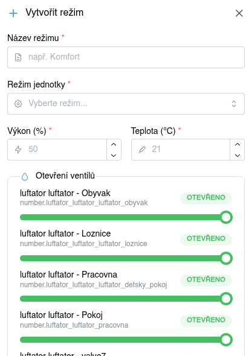
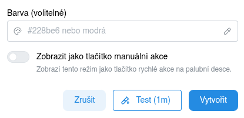
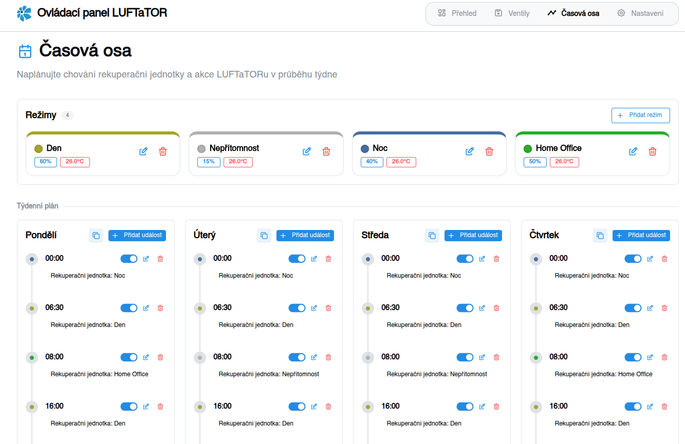
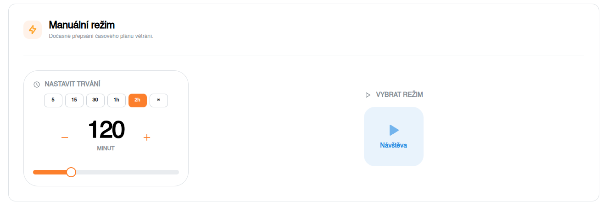
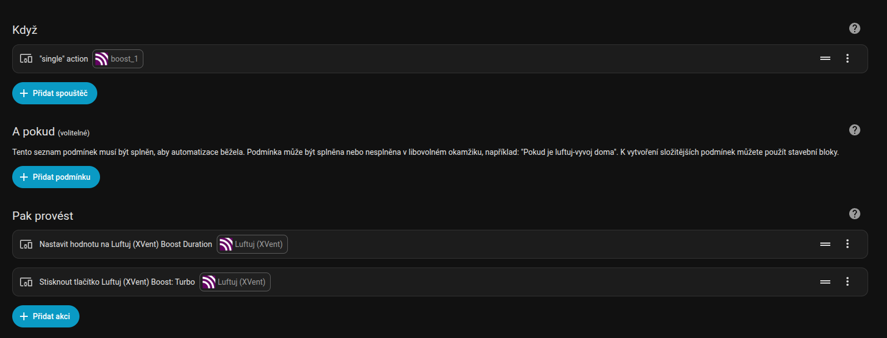
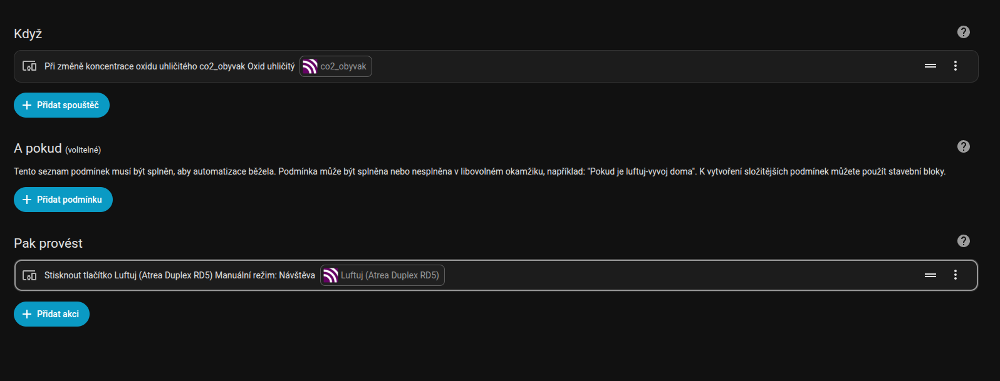

# Nastavení řízení

Jak nastavit týdenní programy, manuální režimy, boost tlačítka či aktivace režimů na základě hodnot čidel kvality vzduchu (např. CO₂) 

## Vytvoření režimů

Režim (nebo také scéna) definuje parametry rekuperační jednotky jako je výkon, teplota či režim jednotky a stav jednotlivých klapek LUFTaTOR Controlu.
Prvním krokem nastavení řízení je tedy definice jednotlivých režimů, které budete využívat. Režim přidátek kliknutím na tlačíko "Přidat režim" na záložce "Časová osa".

Na zobrazeném dialogu zadejte parametry jednotky a pozice jednotlivých klapek.

Ve spodní části pak může zvolit barvu, jakou se tento režim bude zobrazovat na časové ose. Volba rozdílných barev Vám zajistí lepší přehlednost.

Zároveň je zde možné zaškrtnout přepínač "Zobrazit jako tlačítko manuální akce". Všechny režimy, které jsou takto označené se zobrazí na úvodní obrazovce (viz odstavec Nastavení manuálního řežimu).

## Nastavení týdenního programu

V týdenním programu definujete pro jednotlivé dny týdne harmonogram přepínání režimů. Přepínání režimů podle týdenního programu
má vždy nižší prioritu než manuálně spuštěný režim.

Do programu vždy přidejte počáteční čas, který určuje, kdy se režim spustí a název režimu, který chcete aktivovat.

Program pro jednotlivé dny můžete kopírovat kliknutím na tlačítko Kopírovat a poté kliknutím na vložit (tlačítko na stejné pozici u dne, kam chcete program vložit).

## Nastavení manuálního režimu

Pro každé spuštění manuálního režimu je vždy potřeba určit, na jakou dobu ho chceme spustit a poté kliknout na tlačítko s názvem požadovaného režimu.

### Spuštění boost tlačítkem

- V Home Assistantu klikněte na Nastavení | Automatizace a scény
- Klikněte na tlačítko Vytvořit automatizaci | Vytvořit novou automatizaci
- Klikněte na tlačítko "Přidat spouštěč"
- Zvolte Zařízení a vyberte Zařízení odpovídající fyzickému tlačítku, které chcete použít
- Jako spouštěč můžete podle typu tlačítka zvolit např. jedno stisknutí, dlouhé podržení tlačítka nebo dvojité stisknutí.
- Jako akci přidejte Zařízení "Luftuj" - Nastavit hodnotu a zde zadejte hodnotu v minutách, po kterou chcete následující režim aktivovat
- Poté přidejte druhou akci nad Zařízení "Luftuj", a zde vyberte režim, který chcete aktivovat

### Spuštění čidlem CO₂

- V Home Assistantu klikněte na Nastavení | Automatizace a scény
- Klikněte na tlačítko Vytvořit automatizaci | Vytvořit novou automatizaci
- Klikněte na tlačítko "Přidat spouštěč"
- Zvolte Zařízení a vyberte Zařízení odpovídající čidlu CO₂ na základě jehož hodnoty chcete režim spouštět
- Vyberte Koncentrace oxidu uhličitého, zadejte mezní hodnotu a dobu, po kterou musí být podmínka splněna
- Klikněte na tlačítko "Přidat akci"
- Zvolte Zařízení "Luftuj" - Nastavit hodnotu a zde zadejte hodnotu v minutách, po kterou chcete následující režim aktivovat
- Poté přidejte druhou akci nad Zařízení "Luftuj", a zde vyberte režim, který chcete aktivovat

## Plně automatické řízení podle čidel CO₂

:::note[Informace]

Plně automatické řízení multizónového větrání podle čidel CO₂ je momentálně ve vývoji.
Prozatím však můžete využít aktivaci manuálního režimu s časovým doběhem na základě hodnoty načtené z čidla CO₂.
Bližší informace o tom, jak to udělat najdete v předchozím odstavci.

:::

