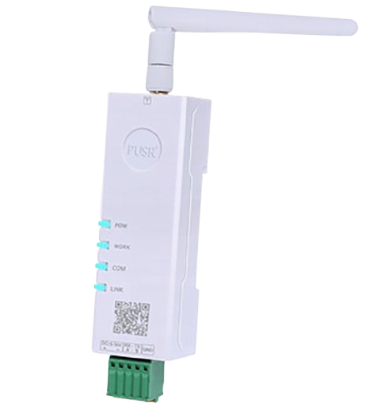
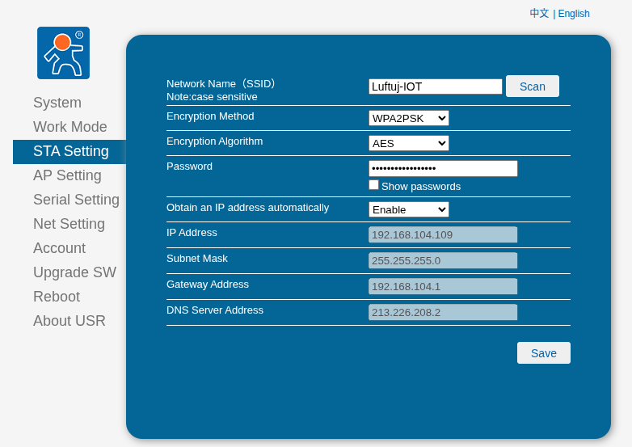
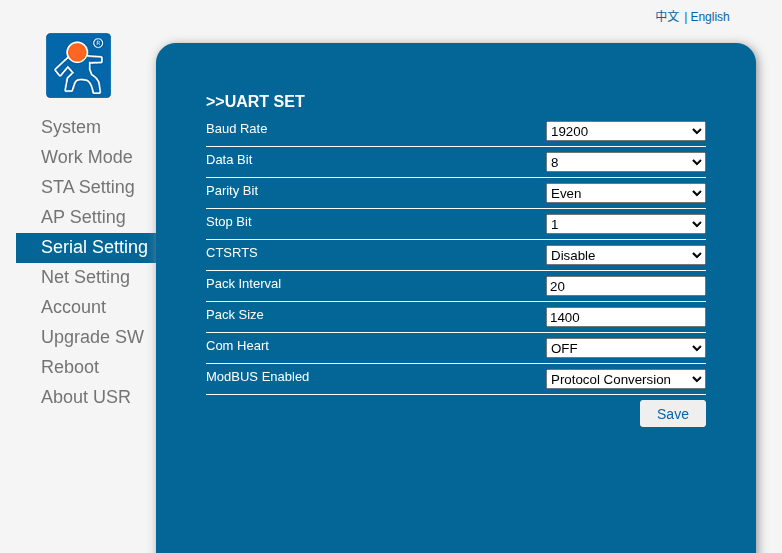
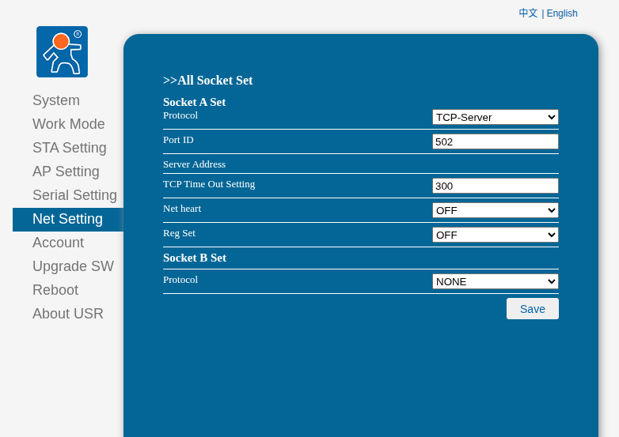

# PUSR DR164

[PUSR DR164](https://www.pusr.com/products/Serial-to-Dual-Band-WiFi-Converter.html) je velmi levný dual band WiFi převodník umožňující
převádět ModbusRTU na ModbusTCP, bez nutnosti tahat jakoukoliv kabeláž.

## Zapojení převodníku

- Připravte si libovolný zdroj stejnosměrného proudu 5-36V a zapojte ho do napájecí svorkovnice převodníku PUSR DR164 (u některých jednotek lze využít napájení přímo z jednotky).
- Modbus datové vodiče A a B zapojte do svorkovnice označené RX/A a TX/B 

## Konfigurace převodníku

- Po zapnutí napájení se připojte na notebooku či telefonu k WiFi síti `USR-DR164-xxxx`
- Otevřete webový prohlížeč a zadejte adresu http://10.10.100.254
- Zadejte uživatelské jméno a heslo pro přihlášení do rozhraní  (výchozí uživatelské jméno: admin, heslo: admin)
- V nastavení `STA Setting` nastavte připojení k Vaší domácí WiFi síti

:::warning[Upozornění]

V případě použití DHCP (Obtain an IP address automatically = Enable) je potřeba vytvořit ve Vašem routeru rezervaci na MAC adresu, aby se přidělená IP adresa neměnila.
MAC adresu převodníku získáte v záložce System.

:::

Pro další informace o konfiguraci převodníku si přečtěte [manuál výrobce](https://www.pusr.com/uploads/20241212/c0e4f462ecead06a7e47e13fee88a488.pdf).

- Na záložce `Serial Setting` nastavte parametry Modbus RTU

Nastavte parametry:
  * Baudrate: 19200
  * Databits: 8
  * Parity: Even
  * Stopbits: 1
  * CTSRTS: Disable
  * ModBUS Enabled: Protocol Conversion

- Na záložce `Net Setting` nastavte číslo portu 502

