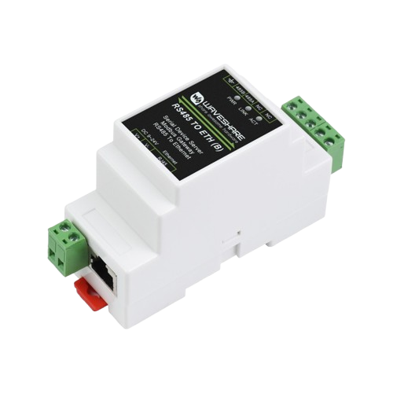

# Waveshare

[Waveshare RS485 to RJ45 Ethernet](https://www.waveshare.com/rs485-to-eth-b.htm) je cenově dostupný převodník umožňující
převádět ModbusRTU na ModbusTCP s rozhraním RJ45 Ethernet.  

## Zapojení převodníku

- Připravte si libovolný zdroj stejnosměrného proudu 9-24V a zapojte ho do napájecí svorkovnice převodníku Waveshare (u některých jednotek lze využít napájení přímo z jednotky).
- Modbus datové vodiče A a B zapojte do svorkovnice označené 485A a 485B 
- Síťový kabel připojte do zdířky RJ45 na převodníku Waveshare.

## Konfigurace převodníku

- Nastavte ve svém PC pevnou IP adresu 192.168.1.100 a masku sítě 255.255.255.0
- Připojte síťový kabel do svého PC či notebooku
- Otevřete webový prohlížeč a připojte se na IP adresu http://192.168.1.254
- Zadejte heslo pro přihlášení do rozhraní  (výchozí heslo: 123456 - napsáno z boku převodníku)
- Nastavte síťové připojení, tak aby zařízení bylo zařazeno ve LAN (buď pomocí statické IP nebo DHCP)

:::warning[Upozornění]

V případě použití DHCP je potřeba vytvořit ve vašem routeru rezervaci na MAC adresu, aby se přidělená IP adresa neměnila.
MAC adresu převodníku naleznete na boku převodníku.

:::

Nastavte parametry:
- Network Settings
  * Device Port: 502
  * Work Mode: TCP Server
- Serial Settings
  * Baudrate: 19200
  * Databits: 8
  * Parity: Even
  * Stopbits: 1
  * Flow control: None
- Mlity-Host Settings
  * Protocol: Modbus TCP to RTU
