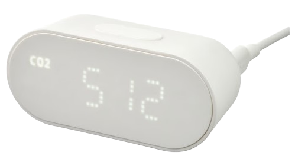

import SensorParams from '@site/src/components/SensorParams';

# Ikea ALPSTUGA

<SensorParams dimensions="90×40×40mm" interf="Matter-over-Thread" power="USB-C" measurements="CO₂, PM2.5, teplota, relativní vlhkost, kvalita vzduchu"></SensorParams>

Ikea ALPSTUGA je levné a zároveň designové čidlo kvality vzduchu komunikující protokolem Matter přes Thread. Hodnoty měření jsou ve srovnání ostatními čidly z levnější kategorie velmi dobré.

## Připojení do Home Assistantu

- Zkontrolute, zda máte potřebný hardware a že jste provedli všechny kroky potřebné pro [instalaci Matter / Thread](/docs/home-assistant#instalace-matter--thread).
- V aplikaci Home Assistant Companion na mobilním telefonu klikněte v Menu na Matter | Přidat zařízení.
- Zvolte, že zařízení je nové (případně ho před tímto krokem resetujte dlouhý podržením tlačítka s kolečkem na spodní straně zařízení, při dlouhém podržení se rozsvítí červená dioda na displeji a spustí se odpočet, tlačítko pusťte až po doběhnutí odpočtu).
- Nascanujte QR kód na spodní straně zařízení
- Při párování jednou stiskněte tlačítko s kolečkem na spodní straně zařízení

