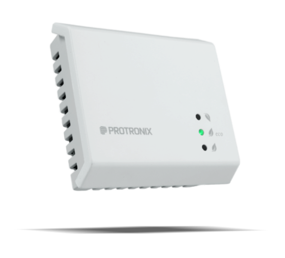

import SensorParams from '@site/src/components/SensorParams';


# Protronix NLII

<SensorParams dimensions="100×100×30,5 mmmm" interf="Modbus RTU" power="12-40 VDC / 14-30 VAC" measurements="CO₂, TVOC,teplota, relativní vlhkost"></SensorParams>

Čidla od Protronixu poskytují kvalitní výstupy měření CO₂, TVOC, teploty a relativní vlhkosti (podle zvoleného modelu).
Čidla je možno připojit drátově pomocí Modbus RTU (ideální je využít drátový nebo WiFi Modbus RTU bridge to Modbus TCP) nebo bezdrátově prostřednictvím [přijímače signálu NL-MRF-RX-CO2+RH](https://www.luftuj.cz/p/prijimac-signalu-nl-mrf-rx-co2-rh/). 




## Připojení do Home Assistantu

- do configuration.yaml přidejte následující kód. Vložete pouze ty bloky, které odpovídají podporovanému měření, které Vámi zakoupené čidlo podporuje.
```yaml
modbus:
  - name: "modbus_gate"
    type: tcp
    host: 192.168.102.55
    port: 502
    sensors:
    # vložte pokud váš sensor podporuje měření CO2
      - name: protronix_nlii_co2
        unique_id: protronix_nlii_co2
        address: 30001
        input_type: input
        scan_interval: 15 
        state_class: measurement
        device_class: carbon_dioxide
        unit_of_measurement: "ppm"

    # vložte pokud váš sensor podporuje měření RH
      - name: protronix_nlii_rh
        unique_id: protronix_nlii_rh
        address: 30002
        input_type: input
        scan_interval: 15 
        device_class: humidity
        unit_of_measurement: "%"
        scale: 0.1
      
    # vložte pokud váš sensor podporuje měření teploty
      - name: protronix_nlii_t
        unique_id: protronix_nlii_t
        address: 30003
        input_type: input
        scan_interval: 15 
        state_class: measurement
        device_class: temperature
        unit_of_measurement: "˚C"
        scale: 0.1
      
    # vložte pokud váš sensor podporuje měření TVOC
      - name: protronix_nlii_tvoc
        unique_id: protronix_nlii_tvoc
        address: 30004
        input_type: input
        scan_interval: 15
        state_class: measurement
        unit_of_measurement: "ppm" 
```

Pokud byste používali více čidel připojených pomocí bezdrátového přijímače signálu, využijte následující dokumentaci [NL-MRF-RX-Modbus - komunikace](https://www.cidla.cz/wp-content/uploads/2024/10/an-NL-MRF-RX-modbus-komunikace-cz.pdf).

